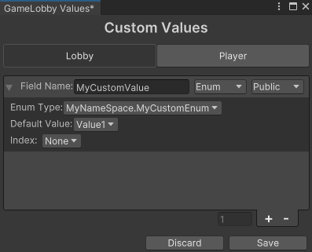

# Custom Enum

To use an enum as a lobby custom value, you either need to create a new script file inside the `Assets/Easy Game Lobby/Runtime` folder or:

1. Create a new folder
2. Add a new [Assembly Definition Reference](https://docs.unity3d.com/Manual/class-AssemblyDefinitionReferenceImporter.html).
      1. Right-click on the new folder and select `Create > Assembly Definition Reference`.
      2. On the `Assembly Definition Reference` inspector, add the `com.oblige.easygamelobby` assembly definition.
3. Create a new script file inside the folder.

After creating the file you can define the enum as you would normally do in Unity, then you have to add the `[CustomEnum]` attribute to the enum class.

```csharp
using EasyGameLobby.Infrastructure;

[CustomEnum]
public enum MyCustomEnum
{
    Value1,
    Value2,
    Value3
}
```

Now you can open the [`Lobby Custom Values`](../getting-started/lobby-settings.md#custom-lobby-and-player-values) window and add a new custom value with the type `Enum` and under its settings, you will see the enum you just created.


