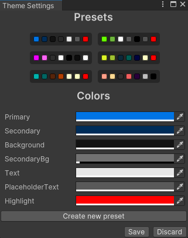

---
hide:
  - navigation
  - toc
---

# Customizing Themes

Each template includes a default color theme, but you can customize it to match the style of your game. Access the Theme Settings window via the `Window` > `GameLobby` > `Theme Settings` menu.

## Presets

The Theme Settings window offers several presets for quickly changing the theme. You can also save your custom theme as a preset by clicking the `Create new preset` button.

## Changing UI Colors

All UI elements have tags associated with specific colors. You can modify these colors, create new ones, or change the tag to apply a different color to the UI element.

## Creating a New Color

Each color in the theme is associated with a tag. To create a new color, start by creating a new tag with the prefix `Template/Colors/` followed by the color name. For example, to create a new tertiary color, create a tag named `Template/Colors/Tertiary` and apply it to the relevant UI GameObjects. Once the tag is created, assign a color to it by using the color picker to select your desired color.
