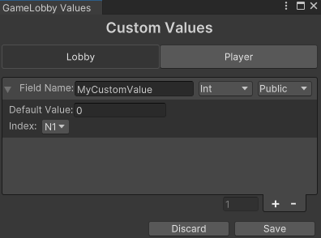

# Settings

## [LobbyManager](../managing-lobbies/lobby-manager.md) Settings

- **Waiting Room Scene:** The scene name considered as the waiting room.
- **Disconnected From Relay:** Determines if the host should kick players from the lobby upon relay disconnection.
- **Host Disconnects:** Determines if the current player should leave the lobby after the relay host disconnects.
- **Game Quit:** Determines if the current player should leave the lobby upon game closure (does not apply to iOS).

## Lobby Settings

Lobby settings window can be accessed from the `Window` > `GameLobby` > `Lobby Settings` menu.

- **Default Max Players:** The default maximum number of players allowed in a lobby.
- **Heartbeat Interval:** Interval in seconds between each lobby heartbeat.

See the official Unity documentation on [Config Options](https://docs.unity.com/ugs/en-us/manual/lobby/manual/config-options) for more information.

### Exceptions

Exceptions trigger the event [`OnMsgPopUp`](../managing-lobbies/lobby-manager.md#onmsgpopup) with the exception message and type.

- **Default Exception:** Default exception text and type sent when an error without a specific exception occurs.
- **Custom Lobby Exceptions:** Custom exceptions displayed for specific errors, any lobby exception can be added. If text is left empty, Unity Lobby default error message will be used; If not added, the default exception will be used.
- **Other Exceptions:** Additional exceptions shown for specific errors.

## Custom Lobby and Player Values

Access the Custom Lobby Values window from `Window` > `GameLobby` > `Set Lobby Values` menu.

Contains lobby and player custom values that can be added, removed, and edited. These values can be accessed/updated on any [LocalPlayer](../managing-lobbies/local-player.md) or [LocalLobby](../managing-lobbies/local-lobby.md) instance.

Available types:

- **String**
- **Int**
- **Float**
- **Bool**
- **Enum** (Refer to [Custom Enum](../others/custom-enums.md) for details)

For custom types implementation, refer to [Custom Lobby Values Types](../others/custom-value-types.md).
{: .info .under-title-h3}

Lobby values can be indexed for filtering lobbies using the [Query Builder](../managing-lobbies/filtering-lobbies/query-builder.md).

There's a limit of 20 lobby values and 10 player values. `Easy Game Lobby` reserves one of each for internal purposes; the player Name value can be removed if not needed.

It's recommended to use custom values for data that doesn't change frequently and/or is required for matchmaking purposes (e.g., game mode, map, etc.). For more dynamic data (e.g., player ready status, player team, etc.), consider using Netcode [RPCs](https://docs-multiplayer.unity3d.com/netcode/current/advanced-topics/messaging-system/) or [Network Variables/Lists](https://docs-multiplayer.unity3d.com/netcode/current/basics/networkvariable/index.html).

Also take a look at Unity's documentation on [Lobby data and player data](https://docs.unity.com/ugs/en-us/manual/lobby/manual/lobby-data-and-player-data).
