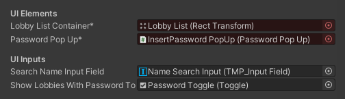

# Template Settings and Concepts

## Concepts

The template scene consists of three essential Game Objects:

- **UI:** The UI Canvas containing all lobby UI elements and scripts.
- **LobbyManager:** The main script controlling the lobby.
- **NetworkManager:** Contains Unity's NetworkManager script.

The UI system contains:

- **Panels:** Display various lobby states such as login, search, and lobby. Each panel has its own script with customizable settings for its behavior and elements, including buttons to show the panel and set it as the default.
- **Sub-panels:** Smaller panels that interact with the main panels, like the Create Lobby panel inside the Search panel. Each sub-panel has its own script with settings for its behavior and elements.
- **Popups:** Small windows showing messages to players, like the Loading popup. Each popup has its own script or is controlled by the panel script.
- **Elements:** Prefabs, Components, buttons, texts, and input fields controlled by panels and sub-panels. Most are optional, but red-marked elements are mandatory, be sure to check the panel they are attached to, before removing them.

You can learn more about inheriting from existing panels or creating your own in the [Custom Panels](../ui-scripts/custom-panels.md#custom-panels) section.

## UI Settings

The UI Canvas contains three panels that may need adjustments to fit your project's needs:

### Login Panel

> By default, the login panel is the first panel that appears when you open the lobby.

Settings:

- **Skip using Steam:** Automatically logs in with the Steam account if enabled.
- **Skip using last login name:** Automatically logs in with the assigned name if enabled.
- **Hide panel if skipping:** Hides the panel if logging in automatically.
- **Auto assign last login name:** Assigns the last used name automatically.
- **Assign random name if empty:** Assigns a random name if none is assigned.
- **Should Try to Reconnect:** Automatically tries to reconnect to the last lobby if enabled.

Enabling "Skip using Steam" or "Skip using last login name" logs in the player automatically upon scene load, even if the panel is not the default. (That way it's possible to show another panel as default while logging automatically).

### Search Panel

> Once the player is logged in, the login panel will automatically change the active panel to the search panel.
>
> If the player leaves a lobby, the [Panels Manager](../ui-scripts/custom-panels.md#panelsmanager) will automatically change the active panel to the search panel.

Settings:

- **Sample results:** Shows a random sample of total results if enabled. (This is useful if you have a large number of lobbies and don't want to show all of them at once.)
- **Should auto refresh:** Automatically refreshes the lobbies list if enabled.
- **Auto refresh rate:** Time in seconds between each auto refresh.
- **Max lobbies:** Maximum number of lobbies to retrieve.

Contains two sub-panels: CreateLobby Panel, JoinByCode Panel, and a Connecting PopUp.

### Lobby Panel

> Once the player joins a lobby, the [Panels Manager](../ui-scripts/custom-panels.md#panelsmanager) will automatically change the active panel to the lobby panel.

It contains a script called `Game Start Manager` with the following settings:

- **Should everyone be ready:** All players must be ready before starting the game if enabled.
- **Should lock lobby:** Locks the lobby upon game start, preventing new players from joining if enabled.
- **Min players to start:** Minimum number of players required to start the game.
- **Should load scene:** Loads the game scene upon game start if enabled, otherwise triggers the [`OnGameStart`](../ui-scripts/components-and-prefabs/game-start-manager.md#events) event.
- **Game scene name:** Name of the scene loaded upon game start.
- **Load scene mode:** Mode in which the scene is loaded.
